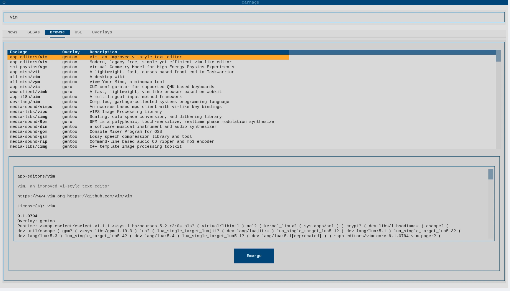

# carnage [](LICENSE) [](https://github.com/dsafxP/carnage/releases) 

<div align="center">


**carnage** is a text-based user interface (TUI) front-end for **Portage** and [**eix**](https://wiki.gentoo.org/wiki/Eix).



</div>

Its goal is to centralize common Gentoo package management tasks in a unified, efficient, and user-friendly interface. It is heavily inspired by [Gentoo Portage Overlays](https://gpo.zugaina.org/), seeking to do everything that it can but ran locally in your machine:

- View Gentoo Repository News
- Read Gentoo Linux Security Advisories
- Browse Portage packages
- Inspect USE Flags
- Manage and explore Overlays

carnage integrates multiple Portage tools (including `eix`) and adds a backend for extended functionality and caching beyond what the command line provides.

A default configuration file is automatically generated at: `~/.config/carnage.toml`

> [!TIP]
> Since **eix** is used for several operations internally, having a remote cache is important to have all options available. Optimizing `eix` in any of the recommended ways will accelerate carnage at the same time. You can read about optimizing `eix` in the [Gentoo Wiki article on eix](https://wiki.gentoo.org/wiki/Eix).

<!--
# Installation

carnage is available through the [GURU](https://wiki.gentoo.org/wiki/Project:GURU) overlay:

```bash
emerge --ask app-portage/carnage
```
-->
